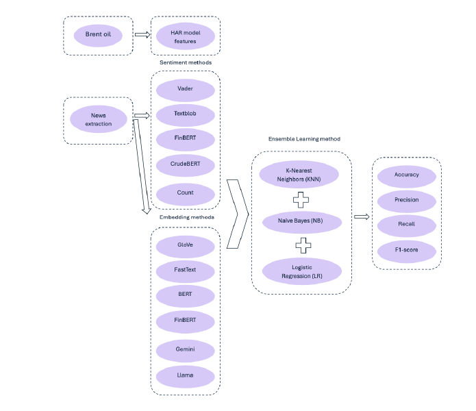
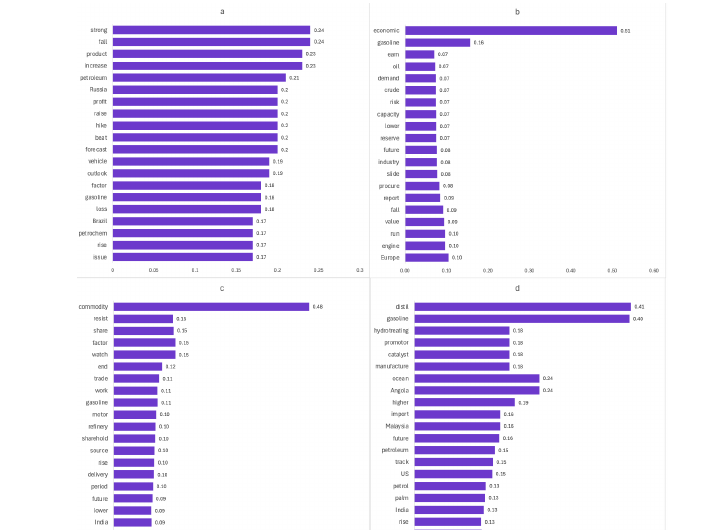

# Can Financial News Predict the Direction of Oil Price Volatility?
## Evidence from Language Models and Regime-Aware SHAP Analysis

Official implementation of the paper:

📄 **Paper (arXiv):** https://arxiv.org/abs/2508.20707

---

## Overview

This repository contains the official implementation accompanying our paper **"Can Financial News Predict the Direction of Oil Price Volatility? Evidence from Language Models and Regime-Aware SHAP Analysis."**

The project investigates whether **financial news alone**, without using historical market variables, can predict the **direction of crude oil price volatility**.

Using **592,858 Reuters news headlines (2014–2023)** together with realized volatility computed from high-frequency Brent crude oil futures, we compare traditional sentiment analysis, transformer-based language models, and large language model embeddings within an ensemble learning framework. The methodology and dataset are described in the accompanying paper. :contentReference[oaicite:0]{index=0}

---

## Workflow



The framework consists of:

- Financial news collection and preprocessing
- Sentiment analysis (VADER, TextBlob, FinBERT, CrudeBERT)
- Text embeddings (GloVe, FastText, BERT, FinBERT, Gemini, LLaMA)
- Ensemble classification
- Statistical evaluation using McNemar's test
- Model interpretation using SHAP

---

## Repository Structure

```text
├── embeddings/              Embedding generation
├── sentiments/              Sentiment analysis
├── prediction/              Ensemble prediction models
├── Explainable_AI_SHAP/     SHAP explainability
├── Visualization/           Figures and plots
├── McNemar_test/            Statistical evaluation
├── Financial_data/          Financial datasets
├── news_data/               News preprocessing
├── total_data/              Combined datasets
├── requirements.txt
└── README.md
```

---

## Models

### Sentiment Models

- VADER
- TextBlob
- FinBERT
- CrudeBERT

### Embedding Models

- GloVe
- FastText
- BERT
- FinBERT
- Gemini
- LLaMA

---

## Methodology

The prediction framework follows four main stages:

1. Clean and preprocess Reuters news headlines.
2. Convert news into sentiment scores or embedding representations.
3. Aggregate daily textual features.
4. Predict next-day volatility direction using an ensemble classifier consisting of:

- Logistic Regression
- Naive Bayes
- K-Nearest Neighbors

Performance is compared against the Heterogeneous Autoregressive (HAR) benchmark and evaluated using the McNemar statistical test. :contentReference[oaicite:1]{index=1}

---

## Main Results

The study shows that:

- FastText achieved the strongest embedding performance.
- News count significantly outperformed traditional sentiment measures.
- SHAP explanations reveal that important predictive language changes across major market events, including COVID-19 and the Russia–Ukraine conflict.
- Textual information alone contains meaningful predictive signals for oil volatility direction. :contentReference[oaicite:2]{index=2}

---

## Explainability



We use SHAP to identify the most influential words driving predictions across four market regimes:

- Before COVID-19
- Pandemic shock
- Post-pandemic stabilization
- Russia–Ukraine conflict

This provides interpretable insights into how language patterns evolve through time and influence volatility forecasts. :contentReference[oaicite:3]{index=3}

---

## Installation

Clone the repository

```bash
git clone https://github.com/Romina-Hashami/Textual_Direction_Prediction_Oil_Volatility.git
```

Install dependencies

```bash
pip install -r requirements.txt
```

---

## Citation

If you use this repository in your research, please cite:

```bibtex
@article{hashami2025news,
  title={Can Financial News Predict the Direction of Oil Price Volatility? Evidence from Language Models and Regime-Aware SHAP Analysis},
  author={Hashami, Romina and Maldonado, Felipe},
  year={2025},
  eprint={2508.20707},
  archivePrefix={arXiv},
  primaryClass={cs.CE}
}
```

---

## Authors

**Romina Hashami**

PhD Candidate  
School of Mathematics, Statistics and Actuarial Science  
University of Essex

**Felipe Maldonado**

Lecturer in Data Science & Operational Research  
University of Essex

---

## License

This repository is released for academic and research purposes.
